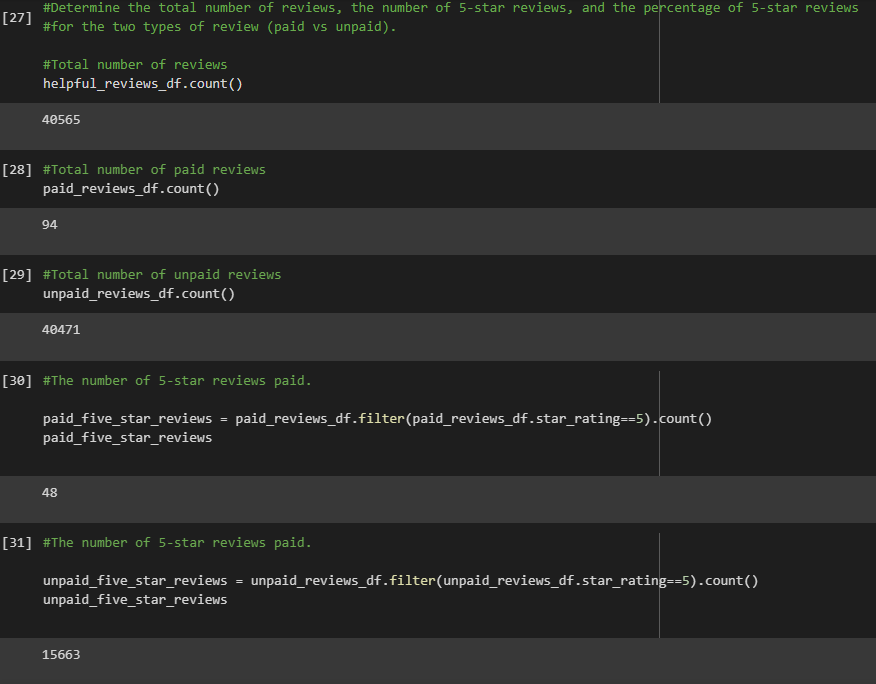
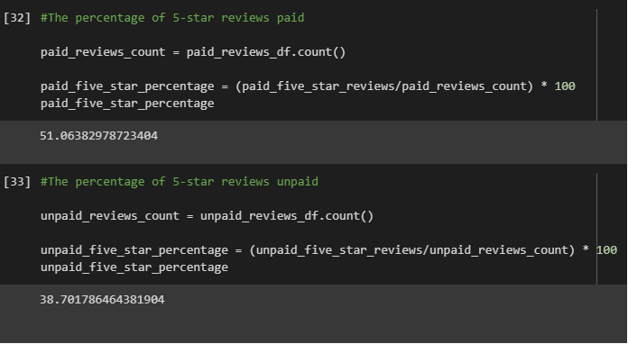

# Amazon_Vine_Analysis

### Programs and Data used for this analysis

Programs : AWS RDS database with tables in pgAdmin, Google Colab with Pyspark

Data : [Video Games Amazon](https://s3.amazonaws.com/amazon-reviews-pds/tsv/index.txt)

## Overview of the analysis: 

The Amazon Vine program is a service that allows manufacturers and publishers to receive reviews for their products. Companies like SellBy pay a small fee to Amazon and provide products to Amazon Vine members, who are then required to publish a review. I chose the video game datasets to analyze and used PySpark to perform the ETL process to extract the dataset, transform the data, connect to an AWS RDS instance, and load the transformed data into pgAdmin. I also used Google Colab with PySpark to determine if there is any bias toward favorable reviews from Vine members in my dataset. 

## Results: 

* Out of the total of 50,565 reviews, 94 of them were paid and 40,471 of them were unpaid.

* Out of those paid and unpaid reviews, 48 of them were five star paid reviews and 15,663 were five star unpaid reviews.

-----------------------------------------------------------------------------------------------------

* So calculating the results show that 51% of paid vine reviews were five star and 38% were unpaid five star reviews. 

---------------------------------------------------------------------------------------------------

## Summary: 

Based on the results, there was a bit of biased from the vine users since half of them had five star reviews. Although there was more non vine users, they were still close to the half being five star reviews. It just shows that most users will hit five stars if they are satisfied with their product. By using this data, we could analyze another data set to confirm if other sets are similar to the video game set. 
